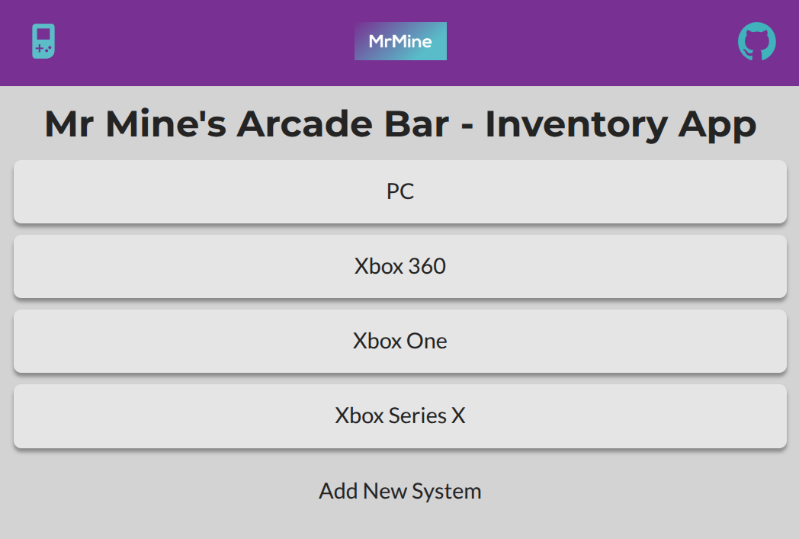

# odin-inventory-app

An Inventory App from The Odin Project.

By building from scratch, this will help solidify my recent learning of back-end server-side website rending using:

- Node,
- Express,
- ejs for views,
- Model View Controller (MVC) design pattern,
- express-validator for forms, and
- PostgreSQL for the database.

The app and database is hosted on railway.

Live Link: https://mrmine-inventoty-app.up.railway.app/

Although this project was for intended an inventory management app for an imaginary shop, such as for groceries or car parts, I decided to create the app for an arcade bar!

An arcade bar is a place to go with friends to drink and play classic arcade video games, like Flynn's Arcade in the Tron films!

I got this inspiration from NQ64 arcade bar in London which I recently went to with Paul and we had a great trip down memory lane, playing classic N64 and original xbox games.

The games in this app are all my favourite video games I've played over the years.

